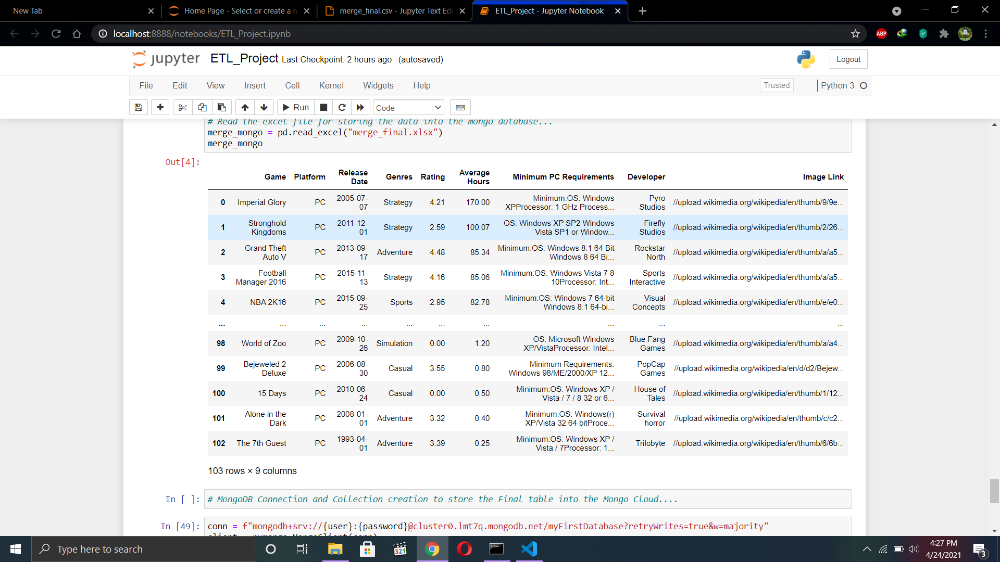

# ETL_Project_Popular_Games

The Project is mainly done to find out the most popular game over the time. So, the Collection of data start with getting the database on how many hours on average the game is played.

After that the Platform Requirement was uploaded, Once this was done the data was fetched using the Game API to get the platform, rating, genres through the API. The link to API is here.

* [Game API Link](https://rawg.io/apidocs) https://rawg.io/apidocs

Once the Data was fetch the Splinter method was used for Web Scrapping.

**Please Note That when you are running the Splinter parts makes sure you read the comments and run only one part for a particular process. There are two different websites used for scrapping the data**

The Data fetch are same but done using two different website. Where one can have the data and other might not contain that data. So their are two website to fetch the data.

The final piece was to store the data into a MongoDB cloud Database.

User name and password for the MongoDB cloud is made availabe into the config.py file. Please use the test user name and password.

# Screenshots

# Conclusion

The aim of the project was to find the most popular running game on which players like to spend their time on play those games. The games are ranked on the bases of the Average Hours palyed by the players.
